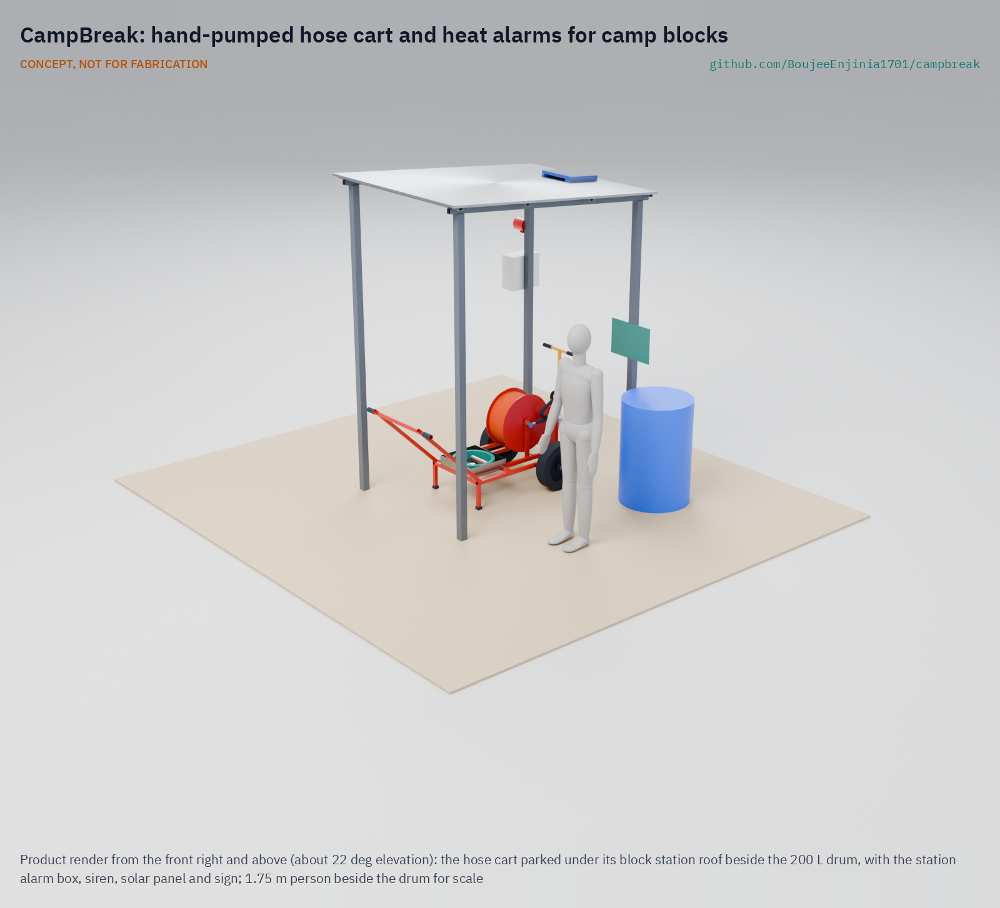

# CampBreak

     

**Area:** Situational field hardware · **TRL:** 3 of 9 (proof of concept on paper; constructable design, plan not yet built) · **Value-engineering target:** USD 1,600 (estimated cost USD 1,374) · **Difficulty:** 2 of 5

Gives camp residents block alarms and a hand-pumped hose cart to fight shelter fires in the first minutes.

## Concept rationale

Most of the damage in a camp fire is decided in the first few minutes, before any fire service arrives. CampBreak gives each camp block two things for those minutes: rate-of-rise heat alarms in the shelters, so the block knows at once, and a hand-pumped hose cart at a block station, so trained residents can put water on the fire while it is still one shelter. Heat alarms are used because smoke alarms go off from cooking smoke and get switched off.

Keeping the kit open and hand-powered matters because the camps that burn most have little money, patchy power and water that runs short in the dry season. The cart needs no fuel and no mains, and a camp workshop can build and repair it. The alarms make no certification claims; they are an open engineering reference that agencies and camp committees can test and adapt.

## Burning platform

The Rohingya camps in Cox's Bazar, Bangladesh, recorded more than 222 fires between January 2021 and December 2022, 60 of them arson ([Wikipedia, citing BBC, 2023](https://en.wikipedia.org/wiki/2023_Kutupalong_refugee_camp_fire)). A single fire in March 2023 destroyed about 2,000 shelters, 2 health centres and 25 learning centres ([NRC, 2023](https://www.nrc.no/news/2023/march/todays-fire-in-coxs-bazar-must-lead-to-better-living-conditions-in-makeshift-camps)). In January 2024 another fire destroyed about 800 shelters in Camp 5; responders reported that hilly ground kept vehicles out, wind drove the fire through thatch roofs, and dry-season hydrants ran dry ([The New Humanitarian, 2024](https://www.thenewhumanitarian.org/news-feature/2024/01/10/fire-bangladesh-rohingya-refugee-camp-where-is-support)).

The pattern is the same in other dense settlements. In Dhaka, fire services took an average of 68 minutes to reach informal settlements against 28 minutes for formal areas, and residents act as first responders with poor equipment ([Engineering X, Royal Academy of Engineering](https://engineeringx.raeng.org.uk/media/03cd1j4l/engx-a-comparative-study-of-fire-risk-emergence-in-informal-settlements-in-dhaka-and-cape-town-short.pdf)). UNHCR planning standards call for 30 m firebreaks every 300 m and at least 2 m between structures ([UNHCR](https://emergency.unhcr.org/emergency-assistance/shelter-camp-and-settlement/camps/site-planning-camps)), but crowded camps rarely achieve this, so fast local response is often the only barrier left.

## Where it could be used

### By industry

| Industry | Use |
| --- | --- |
| Humanitarian shelter and camp management | Block-level alarm and first-response kit in refugee and displacement camps |
| Urban informal settlements | Community fire stations for dense shack and slum neighbourhoods |
| Disaster risk reduction NGOs | Training and equipment package for community fire volunteer programmes |
| Seasonal and labour camps | Worker camps at construction sites, brick kilns and plantations |
| Rural villages with thatch roofs | Shared hose cart for villages far from a fire station |

### By country or region

| Country or region | Why it matters there |
| --- | --- |
| Bangladesh (Cox's Bazar camps) | More than 222 fires in two years, 60 of them arson, and a 2023 fire that destroyed over 2,000 shelters ([Wikipedia, citing BBC, 2023](https://en.wikipedia.org/wiki/2023_Kutupalong_refugee_camp_fire)). |
| Bangladesh (Dhaka informal settlements) | Fire services averaged 68 minutes to reach informal settlements, against 28 minutes elsewhere ([Engineering X](https://engineeringx.raeng.org.uk/media/03cd1j4l/engx-a-comparative-study-of-fire-risk-emergence-in-informal-settlements-in-dhaka-and-cape-town-short.pdf)). |
| South Africa | Shack fires occur every day, killing and injuring hundreds of people each year ([UNDRR, 2024](https://www.undrr.org/resource/learning-those-who-are-most-risk-informal-settlement-fires-south-africa)). |
| Northwest Syria | A local coordination group counted 126 fires in displacement camps in the first eight months of 2022, with most families cooking inside tents ([Al-Monitor, 2022](https://www.al-monitor.com/originals/2022/08/fires-engulf-displacement-camps-northern-syria-during-heat-wave)). |
| Greece and Europe | The 2020 fires at Moria on Lesbos left about 11,500 asylum seekers without shelter ([UN News, 2020](https://news.un.org/en/story/2020/09/1072132)). |

## What sparked the idea

The idea came from the fire in Camp 11 at Kutupalong, Cox's Bazar, on 5 March 2023. It destroyed more than 2,000 shelters, 35 mosques and 21 learning centres and left about 12,000 people without shelter, although it was brought under control in about three hours ([Wikipedia, citing BBC and The Guardian, 2023](https://en.wikipedia.org/wiki/2023_Kutupalong_refugee_camp_fire)). Three hours is fast for a fire service in a hilly, crowded camp, but far too slow for bamboo and tarpaulin. The damage was done in the first minutes, when the only people present were residents with buckets.

## Problem

Fires in dense camps of bamboo and tarpaulin shelters spread from shelter to shelter within minutes, and fire engines often cannot reach them in time. Residents are the first responders, but they usually have only buckets.

Full problem statement: [docs/01-problem.md](docs/01-problem.md)

## Concept

A camp-block kit of rate-of-rise heat alarms and a hand-pumped hose cart; when an alarm sounds, residents wheel the cart from its block station to the burning shelter and pump water from a drum or tap through the hose to knock the fire down in the first minutes.

Full design precis: [docs/02-concept.md](docs/02-concept.md) · Requirements: [docs/03-requirements.md](docs/03-requirements.md) · Calculations: [docs/04-calcs/01-sizing.md](docs/04-calcs/01-sizing.md) · Prototype build plan: [docs/05-build-plan.md](docs/05-build-plan.md) · Design decisions: [docs/06-design-decisions.md](docs/06-design-decisions.md) · 3D viewer: [media/viewer.html](media/viewer.html)

## Key components

- Rate-of-rise heat alarm, one per shelter, hung under a roof pole
- Block station: four-post shade roof, station alarm box with siren and solar panel, sign and 200 L drum
- Two-wheeled hose cart: welded steel frame, 400 mm puncture-proof wheels
- Semi-rotary hand pump with a two-person T-bar lever and a 4 bar relief valve
- 30 m of 19 mm hose on a reel, stowed full of water behind the shut nozzle, with a jet and spray nozzle
- 4 m suction hose with foot valve strainer, quick couplings and a tap adaptor

Key figures at TRL 3 (estimates): about 20 L/min at the nozzle with two people pumping, a jet reach of about 6.9 m, an alarm relay of 7.2 s, and a 103 kg cart (delivery hose stowed full) that two people pull up a 10 % slope at about 101 N each, 1 N over the 100 N assumed sustainable. A check foot valve keeps the pump primed, the suction hose stays coupled, and volunteers go when two arrive. Water on target within 3 minutes is met on paper for a shelter 100 m away (2.95 min, 3 s to spare), because the delivery hose is stowed full; stations are still sited within 70 m of every shelter (2.5 min).

## Building the prototype

The [prototype build plan](docs/05-build-plan.md) shows how to build one block kit, component by component, with a making sketch for every made part, close-ups of the joints and a picture for each of the 21 assembly steps. The cart and station are mild steel tube and plate, cut, drilled and MIG welded, with bought wheels, pump, reel and hoses; the alarm is a drilled stock box on a small aluminium plate. The plan is a plan: nothing has been built or tested yet, and building to it is TRL 4 work. Safety stops before welding, first pumping, loading and wiring are listed in its section 6.

## Safety

> Published as an open engineering reference, not as certified fire alarms or firefighting equipment.
>
> The kit is for small, early fires only. People leave first; nobody enters a burning shelter or stays when the fire spreads.
>
> Never use water on burning cooking oil or on live electrical wiring.
>
> Pressurised hose and pump can injure. The relief valve opens at 4 bar with its discharge pointing down; check hose, clips and fittings before every drill and never point the jet at people.
>
> Heat alarms use alkaline AA cells and the station a sealed lead-acid battery; there are no lithium cells in the kit. Follow the camp's disposal rules.
>
> This design is published as an open engineering reference at TRL 3: a concept, not for fabrication until it is built and tested at TRL 4. It is not certified equipment.

## Repository layout

| Folder | Contents |
| --- | --- |
| `docs/` | Problem, concept, requirements, calculations and design decisions |
| `cad/src/` | build123d Python source, the source of truth for all geometry |
| `cad/step/`, `cad/stl/` | Exported models for FreeCAD, other CAD tools and printing |
| `cad/drawings/` | 2D sketches and dimensioned drawings |
| `bom/` | Bill of materials |
| `electronics/` | KiCad schematics and PCB layouts |
| `firmware/` | Microcontroller code |
| `media/` | Renders, perspectives and photos |
| `build-log/` | Dated prototyping notes |

## Documentation

Controlled documents follow the portfolio [documentation standard](.kit/STANDARDS.md). Each carries a document ID (CBK-PRC-001 for the precis), a version and a revision history. Branded PDFs are built with `python .kit/render.py` and attached to GitHub Releases when a document is tagged, for example `CBK-PRC-001/v1.0`.

## Credits

Designed by Amish Chadha at Design Molecule Labs. See [CONTRIBUTORS.md](CONTRIBUTORS.md) for roles. To cite this design, use [CITATION.cff](CITATION.cff) (GitHub shows it as "Cite this repository").

AI assistance (Claude) was used to accelerate prototype documentation and first-pass research. Design direction and all decisions are Amish Chadha's, recorded in this repository's decision records (`docs/decisions/`).

## Licenses

- **Hardware** (CAD, drawings, BOM, electronics): [CERN-OHL-S v2](LICENSE)
- **Software** (firmware, scripts, notebooks): [MIT](LICENSE-SOFTWARE)

A project of [Design Molecule Labs](https://designmolecule.com).
