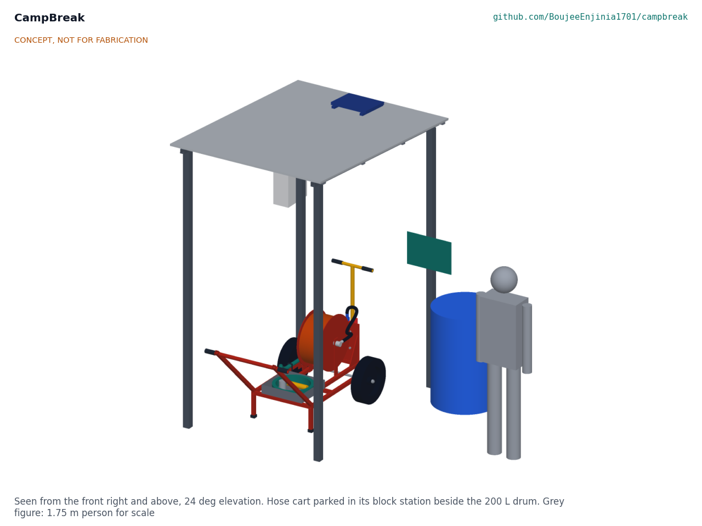
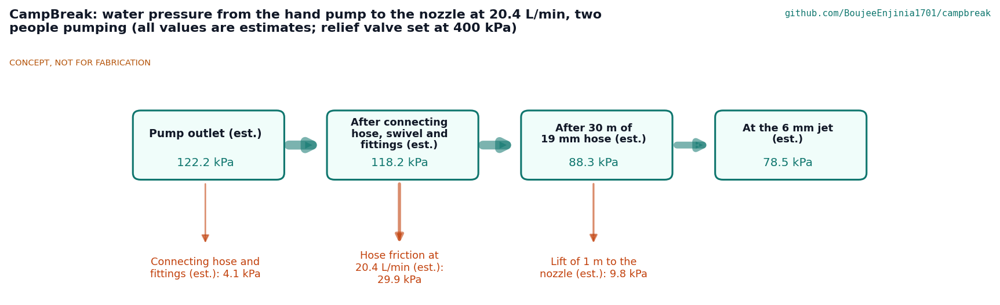
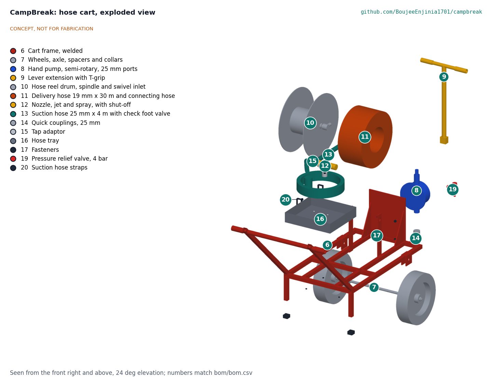
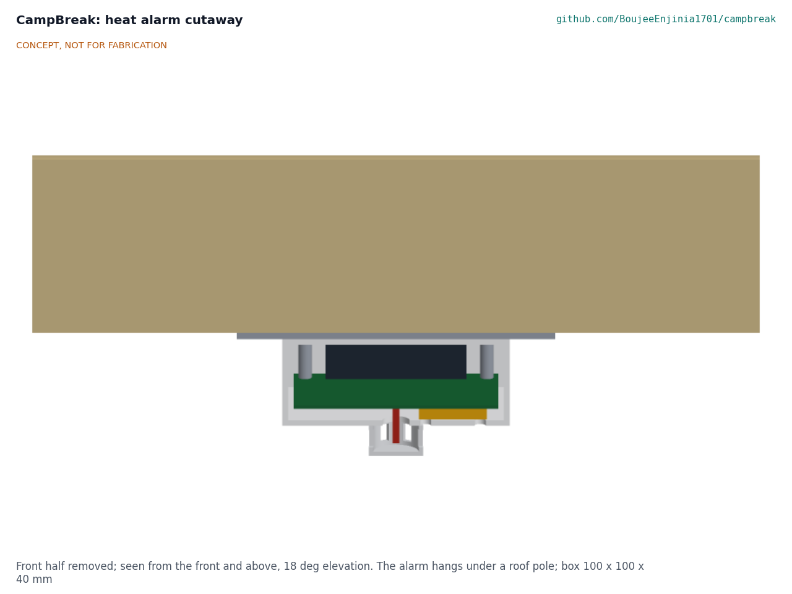

# CampBreak design precis

Gives camp residents block alarms and a hand-pumped hose cart to fight shelter fires in the first minutes.

*Figure 1. Concept render of the block station and hose cart, from the TRL 3 model.*

## How it works

Each shelter in a block gets a battery heat alarm hung under a roof pole. When the air at the alarm warms by 8 °C per minute or more, or passes 57 °C, the alarm sounds and radios the block station. The station sounds a 110 dB(A) siren and broadcasts once, so every alarm in the block sounds within about 7 s. Volunteers run to the station, pull out the two-wheeled hose cart and take it to the burning shelter. There they drop the suction hose into a water drum, jerrycan or open container (or connect the tap adaptor to a standpipe), run out the hose from its reel, and two people pump the T-bar lever to drive about 20 L/min through a 6 mm jet that reaches about 7 m. The aim is to keep a fire to one shelter while others clear the neighbours and call the fire service.

*Figure 2. Pressure along the water line at 20.4 L/min with two people pumping; all values are estimates from CBK-CAL-001.*

## Components

*Table 1. Main components (numbers match bom/bom.csv).*

| BOM | Component | What it is |
| --- | --- | --- |
| 1 | Heat alarm (24 per block) | Stock ABS box 100 x 100 x 40 mm with a controller and sub-GHz radio board, a thermistor below the box in a printed guard, a 95 dB(A) piezo and three AA alkaline cells; hung under a roof pole on an aluminium plate and two cable ties |
| 2 | Station alarm box, siren and solar panel | Locked IP65 box with the receiver board, charge controller and 12 V 7 Ah sealed lead-acid battery; 110 dB(A) siren; 10 W panel on the roof |
| 3 | Station frame and roof | Four 60 mm square posts in concrete collars, two beams, four purlins, corrugated sheet; about 1.5 x 2.05 m of shade |
| 4, 5 | Sign and water drum | Instructions in the camp languages; a 200 L drum beside the cart |
| 6 | Cart frame | Welded 30 mm square tube frame with pull handle, pump stand, reel uprights and axle plates |
| 7 | Wheels | Two 400 mm puncture-proof wheels on a 20 mm through axle |
| 8, 9 | Hand pump and lever | Cast-iron double-acting semi-rotary pump, 25 mm ports, with a T-bar lever for two people |
| 10, 11 | Reel and hose | 30 m of 19 mm semi-rigid hose on a reel with a swivel inlet, fed from the pump by a short connecting hose |
| 12 to 15, 20 | Nozzle, suction hose, couplings, tap adaptor, hose straps | Jet and spray nozzle with shut-off; 4 m of 25 mm suction hose with a brass check foot valve, left coupled to the pump inlet and strapped along the left rail so the pump stays primed; cam-lever couplings; a push-on tap adaptor |
| 16 | Hose tray | Folded galvanised tray on the cart that carries the suction hose and small parts |
| 19 | Relief valve | 4 bar spring relief valve at the pump outlet |

*Figure 3. Exploded view of the hose cart; callouts match bom/bom.csv.*

*Figure 4. The heat alarm cut open: battery holder, board, sounder and the thermistor below the box.*

## Key design choices

All decided under Amish's 2026-10-03 pre-approval (CBK-DDR-001 and CBK-DDR-002):

1. **Heat, not smoke.** Rate of rise of 8 °C per minute with a 57 °C fixed back-up, because shelters cook with open flames.
2. **Star relay, published in full.** Alarms report to the station, which broadcasts once; no mesh.
3. **A bought pump.** A semi-rotary wing pump is sold in most target markets and is repaired with hand tools.
4. **No lithium cells.** Alkaline cells in the alarms and a sealed lead-acid battery at the station.
5. **Relief valve at 4 bar** so a shut nozzle cannot over-pressure the hose or fittings.
6. **A cart two people can pull,** 850 mm wide, about 103 kg loaded and primed, with the delivery hose full, on 400 mm puncture-proof wheels.
7. **Stations sited within 70 m of every shelter** as the siting margin for the 3 minute target.

Decided by Amish on 2026-10-03 ("1A 2A 3A 4A 5A 6A 7A 8A 9A 10A 11A"; CBK-DDR-003):

8. **A primed pump and a coupled suction hose.** A check foot valve keeps the pump and suction hose full, and the hose stays coupled to the pump, so nothing is coupled or primed at the fire.
9. **Go when two arrive.** The first two volunteers at the station take the cart, within 30 s of the siren; the rule is drilled and printed on the drill card.

## First-order numbers

*Table 2. Key figures (CBK-CAL-001; estimates unless stated).*

| Quantity | Value | Main assumption |
| --- | --- | --- |
| Flow at the nozzle | 20.4 L/min | 0.40 L per double stroke at 60 per minute, 85 % volumetric efficiency |
| Jet reach | 6.9 m | Half the drag-free range of a 12.5 m/s jet at 30° |
| Effort per person | 47 W, about 28 N at the grip | 50 % mechanical efficiency |
| Pump outlet pressure | 1.2 bar | 30 m of 19 mm hose, nozzle 1 m above the pump |
| One 200 L drum | about 10 min | |
| Alarm sound at 3 m | 85.5 dB(A) | 95 dB(A) at 1 m |
| Alarm relay, worst case | 7.2 s | Three retries, station broadcast heard within 4 s |
| Alarm battery life | Cell shelf life (about 5 years) | 6.9 µA average |
| Cart mass, loaded and primed | 103 kg | Catalogue masses for bought parts; 2.6 kg of water in the pump and suction hose and 8.9 kg in the delivery hose |
| Pull on a 10 % slope | 101 N per person | Rolling resistance 0.10; 1 N over the 100 N assumed sustainable |
| Water on target | 2.95 min at 100 m; 2.5 min at 70 m | 1.0 m/s walking, 30 s gather, delivery hose stowed full |
| Block kit cost | USD 1,374 | bom/bom.csv |

Value-engineering target: USD 1,600. Estimated cost of the constructable design: USD 1,374 (USD 226 under the target).

## Patent design-arounds

From the preliminary patent, trademark and prior-art screen (not legal advice):

- Rate-of-rise heat sensing, as the preliminary screen advised; no alarm certification is claimed.
- Lumkani's networked heat detector has no patent identified in the preliminary screen, but its mesh network is described as patented. CampBreak uses a plain star scheme (alarm to station, station broadcast to all), published in full, and is checked again before release.

## Shared blocks

- FieldNode sensor core (power and radio lessons for the alarm and block station)
- CalRig proof-load (pressure and hose proof testing)
- BreakHook (sibling: opening firebreaks in dense settlements)

## Safety

> **Safety:** The kit is for small, early fires only. People leave first; nobody enters a burning shelter or stays when the fire spreads, and the fire service is called at once. Never use water on burning cooking oil or on live electrical wiring.

> **Safety:** The pump, hose and nozzle are pressurised. The relief valve opens at 4 bar and points its discharge at the ground; the hose is rated at 10 bar. Check the hose, clips and couplings before every drill, never point the jet at people, and shut the nozzle only while someone is still at the pump.

> **Safety:** The station battery is sealed lead-acid: fuse it at the terminal, keep it in the locked box, and recycle it through a battery dealer. The alarms use alkaline AA cells; follow the camp's disposal rules. There are no lithium cells in the kit.

> **Safety:** The loaded cart weighs about 103 kg, with the delivery hose full. Two people pull it; on slopes steeper than 10 % a third person holds it back. Park it on its feet with the handle down.

This design is published as an open engineering reference by Design Molecule Labs. It is not certified equipment.

## Open questions

None at design level. Items that can only be settled with real parts are listed in the design decisions register (`docs/06-design-decisions.md`).
